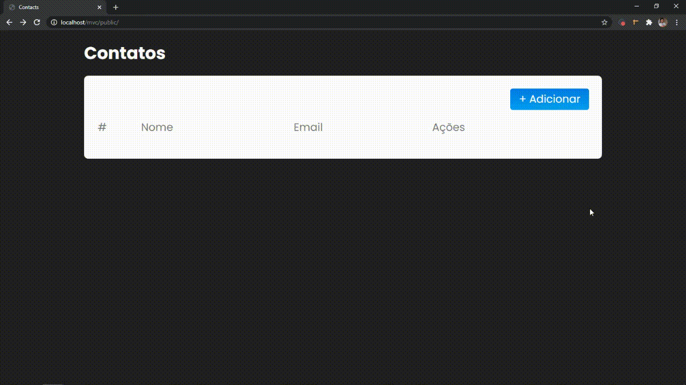

_English_

# Contacts

🗒 A contact list with email name and options for editing and deleting.

`Web preview`


## 📈 Example usage

Here you have your contact list where you can add new contacts or edit and delete existing contacts by clicking on the icons on the right.

## 💻 Configuration for Development

Windows:

You can clone the repository through CMD (Command Prompt) just by typing:

```sh
git clone https://github.com/devgabrieldejesus/contacts
```

or download the zip from the green button at the beginning of the repository


## 🗃 Release history

* 0.1.0
    * Project finalized and studying the possibility of adding new resources
    * The first suitable launch
* 0.0.1
    * Work in progress

## 📝 Meta

Gabriel de Jesus – (https://www.gabrieldesenvolvedor.com/) – oi@gabrieldesenvolvedor.com

Distributed under the MIT License. See `LICENSE` for more information.

[https://github.com/devgabrieldejesus/contacts](https://github.com/devgabrieldejesus/)

## 🚀 Contributing

1. Fork it (<https://github.com/devgabrieldejesus/contacts/fork>)
2. Create your feature branch (`git checkout -b feature/fooBar`)
3. Commit your changes (`git commit -am 'Add some fooBar'`)
4. Push to the branch (`git push origin feature/fooBar`)
5. Create a new Pull Request

---

_Português_

# Contatos

🗒 Uma lista de contatos com nome de e-mail e opções para edição e exclusão.

`Visualização da Web`


## 📈 Exemplo de uso

Aqui você tem sua lista de contatos onde você pode adicionar novos contatos ou editar e excluir contatos existentes clicando nos ícones à direita.

## 💻 Configuração para Desenvolvimento

Windows:

Você pode clonar o repositório por meio do CMD (Prompt de Comando) apenas digitando:

```sh
git clone https://github.com/devgabrieldejesus/contacts
```

ou baixe o zip do botão verde no início do repositório


## 🗃 Histórico de lançamento

* 0.1.0
    * Projeto finalizado e estudando a possibilidade de agregar novos recursos
    * O primeiro lançamento adequado
* 0.0.1
    * Trabalho em progresso

## 📝 Meta

Gabriel de Jesus – [My portfolio](https://www.gabrieldesenvolvedor.com/) – oi@gabrieldesenvolvedor.com

Distribuído sob a licença MIT. Veja `LICENSE` para mais informações.

[https://github.com/devgabrieldejesus/contacts](https://github.com/devgabrieldejesus/)

## 🚀 Contribuição

1. Fork it (<https://github.com/devgabrieldejesus/contacts/fork>)
2. Crie seu branch de recurso (`git checkout -b feature / fooBar`)
3. Faça commit de suas alterações (`git commit -am 'Add some fooBar'`)
4. Empurre para o branch (`git push origin feature / fooBar`)
5. Crie uma nova solicitação pull
